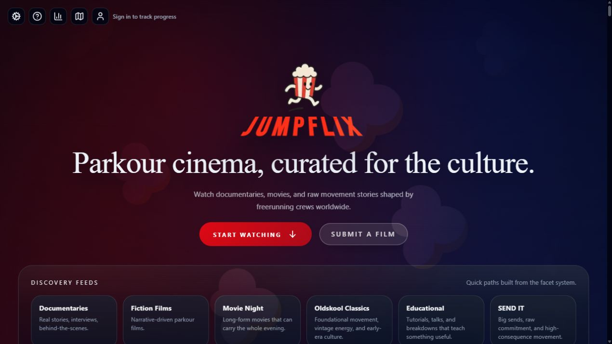
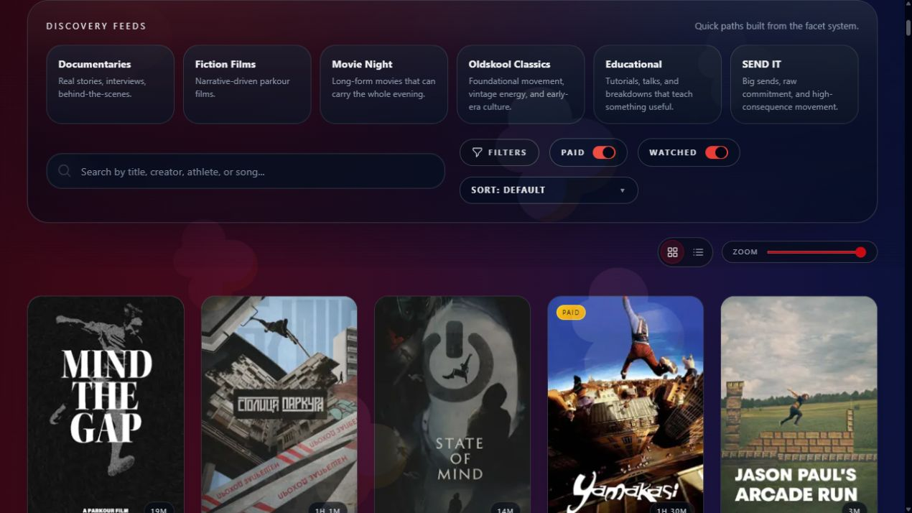
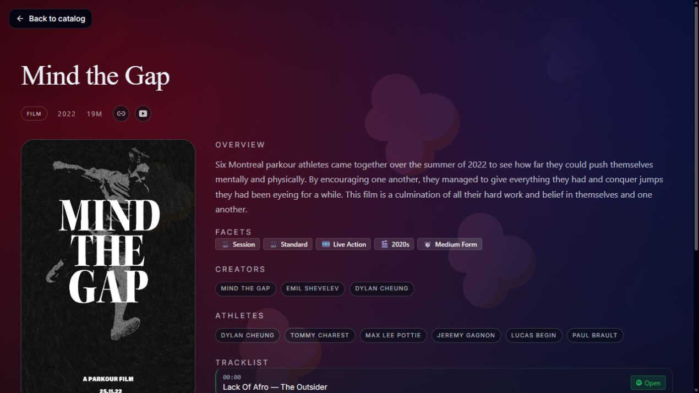
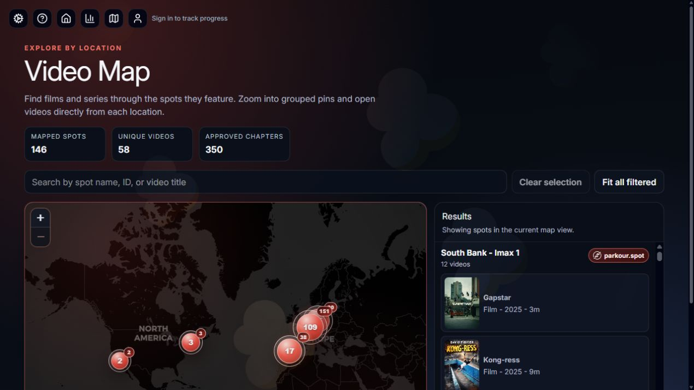

<div align="center">


# Parkour cinema, curated for the culture

**Discover films, documentaries, series, and raw movement stories from the global parkour community.**

[](https://www.jumpflix.tv/)

[](https://app.netlify.com/projects/jumpflix/deploys)
[](https://creativecommons.org/licenses/by-nc-nd/4.0/)

</div>



## What is JUMPFLIX?

JUMPFLIX is a community-built home for parkour and freerunning films. It brings scattered videos, series, documentaries, and classics together in one calm, cinematic catalog.

It is not a pirate streaming service. JUMPFLIX plays or links to legitimate sources such as YouTube, Vimeo, creator-hosted video, and official paid providers. Creators keep their views, their credit, and control of their work.

You can browse and watch without an account. Signing in adds personal features such as watch progress, ratings, reviews, and contribution history.

## What can you do?

- **Find something worth watching** — search by title, creator, athlete, or even a song from a film.
- **Browse by vibe** — use ready-made feeds or detailed filters for format, movement, environment, era, length, and more.
- **Watch your way** — play supported videos inside JUMPFLIX, continue where you stopped, cast to another screen, or open the official provider.
- **Keep track** — mark films as watched, save playback progress, rate releases with the Bangerometer, and write short reviews.
- **Explore the culture** — follow creator and athlete credits, discover soundtracks, and see which real-world spots appear in each video.
- **Travel through the archive** — use the Video Map to browse films by location and jump directly to mapped chapters.
- **Take it with you** — install JUMPFLIX as a PWA and switch between English, Dutch, and Japanese.
- **Help it grow** — submit missing films and suggest spot chapters from the site.

> **Little secret:** hold the spacebar, or long-press the player, for slow motion.

## See it in action

### Discover films without knowing what to search for

Start with a curated feed, search across the catalog, or combine filters. Free and paid releases are clearly marked.



### More than a poster and a play button

Film pages bring the story, facets, creators, athletes, soundtrack, ratings, reviews, and featured spots together.



### Find the films behind famous spots

The Video Map connects approved video chapters to real parkour locations, with links back to [parkour.spot](https://parkour.spot/).



## Built for the community

JUMPFLIX treats parkour films as culture worth preserving, not disposable content. The project aims to make important work easier to find while keeping the experience calm, fast, and respectful.

- Official sources and providers are preferred.
- Creators and athletes are credited whenever that information is available.
- Paid releases stay paid; JUMPFLIX does not work around access restrictions.
- The catalog is curated rather than generated by an engagement algorithm.
- Community submissions are reviewed before they become part of the archive.

## Frequently asked questions

<details>
<summary><strong>Do I need an account?</strong></summary>

No. Browsing and watching are open. An account is only needed for personal features such as watch history, ratings, reviews, and suggestions.

</details>

<details>
<summary><strong>Does JUMPFLIX host every video?</strong></summary>

No. Most releases are embedded from or linked to their official source. Some content can also use creator-approved hosted streams.

</details>

<details>
<summary><strong>Can I submit a film?</strong></summary>

Yes. Choose **Submit a film** on [jumpflix.tv](https://www.jumpflix.tv/) and send the legitimate source URL. You can also contribute through a pull request.

</details>

<details>
<summary><strong>Can I use JUMPFLIX on a TV or phone?</strong></summary>

Yes. The interface is responsive, can be installed as a PWA, and supports AirPlay or Chromecast when the browser and video provider allow it.

</details>

---

## Run JUMPFLIX locally

Everything below is for contributors and people who want to run their own development copy.

### Requirements

- [Node.js](https://nodejs.org/) 20 or newer
- npm
- A [Supabase](https://supabase.com/) project

### 1. Install the project

```bash
git clone https://github.com/m-a-x-s-e-e-l-i-g/jumpflix.tv.git
cd jumpflix.tv
npm ci
```

### 2. Add the minimum configuration

Copy `.env.example` to `.env`, then add your Supabase project values:

```bash
PUBLIC_SUPABASE_URL="https://your-project.supabase.co"
PUBLIC_SUPABASE_ANON_KEY="your-anon-key"
```

`SUPABASE_SERVICE_ROLE_KEY` is only required for privileged admin scripts and server-side maintenance. Never expose it to browser code or commit it to Git.

### 3. Apply the database schema

The schema is stored as ordered SQL migrations in [`supabase/migrations`](./supabase/migrations). Apply them through the Supabase dashboard or link the project with the Supabase CLI and run:

```bash
supabase db push --linked
```

### 4. Start the app

```bash
npm run dev
```

Open the local URL printed by Vite, usually <http://localhost:5173>.

## Everyday development commands

| Command                    | What it does                                             |
| -------------------------- | -------------------------------------------------------- |
| `npm run dev`              | Start the development server                             |
| `npm run check`            | Run Svelte and TypeScript diagnostics                    |
| `npm run lint`             | Check formatting and ESLint rules                        |
| `npm run format`           | Format the project                                       |
| `npm run build:no-sitemap` | Create a production build without submitting the sitemap |
| `npm run preview`          | Preview the production build locally                     |
| `npm run test:mcp`         | Run the MCP server test suite                            |
| `npm run admin`            | Open the interactive content-management CLI              |
| `npm run backup`           | Create a local database backup                           |

The regular `npm run build` command also runs sitemap submission. Use `build:no-sitemap` for routine local verification.

## Optional configuration

Only the two public Supabase values are needed for the basic app. Other integrations are opt-in.

| Variable                                     | Used for                                                   |
| -------------------------------------------- | ---------------------------------------------------------- |
| `SUPABASE_SERVICE_ROLE_KEY`                  | Admin tools, protected maintenance, and server-side writes |
| `ADMIN_EMAILS`, `ADMIN_USER_IDS`             | Access to browser-based admin pages                        |
| `TELEGRAM_BOT_TOKEN`, `TELEGRAM_CHANNEL_ID`  | Film submission notifications                              |
| `SPOTIFY_CLIENT_ID`, `SPOTIFY_CLIENT_SECRET` | Looking up and importing soundtrack metadata               |
| `PARKOUR_SPOT_API_KEY`                       | Resolving spot information from parkour.spot               |
| `PARKOUR_SPOT_BEARER_TOKEN`                  | Authenticating the partner video API                       |
| `OPENAI_API_KEY`                             | Optional admin metadata and poster tools                   |
| `BUNNYNET_API_KEY`, `OPENAI_ADMIN_KEY`       | Optional project-cost import jobs                          |

See [`.env.example`](./.env.example) for the full list and [`docs/MCP.md`](./docs/MCP.md) for MCP-specific authentication settings.

## How it is built

| Area              | Technology                                                       |
| ----------------- | ---------------------------------------------------------------- |
| Application       | SvelteKit 2, Svelte 5, TypeScript, Vite                          |
| Interface         | Tailwind CSS 4, Bits UI, custom Svelte components                |
| Data and accounts | Supabase Postgres and Supabase Auth                              |
| Playback          | Vidstack with YouTube, Vimeo, HLS, and external-provider support |
| Languages         | Paraglide JS with English, Dutch, and Japanese messages          |
| App experience    | Service worker, web app manifest, installable PWA                |
| Hosting           | Netlify adapter and deployment workflow                          |

The default catalog order uses a seeded shuffle. It feels varied, but remains stable during a session so cards do not jump around while somebody is browsing. Search, sorting, discovery feeds, and facet filters are applied on top of the same catalog model.

## Content management

Run the interactive admin tool with:

```bash
npm run admin
```

It can add and edit films or series, sync YouTube playlist episodes, maintain Spotify-backed tracklists, generate BlurHash placeholders, and review catalog metadata. Privileged actions require `SUPABASE_SERVICE_ROLE_KEY`.

More detail is available in [`scripts/README.md`](./scripts/README.md).

## APIs and integrations

### Read-only MCP server

JUMPFLIX includes a remote MCP server at `/mcp` for structured, read-only catalog discovery. It exposes films, series, episodes, people, music, reviews, and parkour spots to compatible clients. OAuth and a static bearer-token fallback are supported.

See [`docs/MCP.md`](./docs/MCP.md) for tools, resources, authentication, pagination, and deployment guidance.

### Partner API

Authenticated API endpoints expose video-to-spot mappings and approved spot chapters for integrations such as parkour.spot.

See [`docs/API.md`](./docs/API.md) for the request and response formats.

### Other project docs

- [`docs/FACETS.md`](./docs/FACETS.md) — the catalog's browse and tagging model
- [`docs/BLURHASH.md`](./docs/BLURHASH.md) — poster placeholder generation
- [`docs/SITEMAP_SUBMISSION.md`](./docs/SITEMAP_SUBMISSION.md) — sitemap generation and submission
- [`static/brand/README.md`](./static/brand/README.md) — source assets and icon generation

## Project structure

```text
src/
  lib/
    components/       Reusable interface components
    server/           Server-only data and integration code
    tv/               Catalog, detail, and player components
  routes/             Pages, APIs, OAuth, and MCP endpoints
messages/             Source translations (en, nl, ja)
scripts/              Admin, backup, import, and asset tools
static/               Brand assets, posters, thumbnails, and screenshots
supabase/migrations/  Ordered database schema changes
tests/mcp/            MCP server tests
docs/                 Focused technical documentation
```

## Contributing

Pull requests are welcome, especially for:

- verified films, documentaries, and series with legitimate source links;
- missing creator or athlete credits;
- translations;
- accessibility and performance improvements;
- corrections to metadata, tracklists, facets, or mapped spots.

Before opening a pull request:

```bash
npm run lint
npm run check
npm run build:no-sitemap
```

Please read the [`CODE_OF_CONDUCT.md`](./CODE_OF_CONDUCT.md) and keep content submissions respectful of creator rights.

## License and attribution

The repository is licensed under [Creative Commons Attribution-NonCommercial-NoDerivatives 4.0 International](https://creativecommons.org/licenses/by-nc-nd/4.0/).

Third-party videos, thumbnails, names, logos, and provider assets remain the property of their respective owners. This repository contains catalog metadata, interface code, and links or identifiers for externally hosted media; it does not grant rights to that third-party material.

If an asset or listing raises a rights concern, please open an issue or pull request so it can be reviewed.

<div align="center">

---

[jumpflix.tv](https://www.jumpflix.tv/) · Made with 🍿 by [Max Seelig](https://www.maxmade.nl/)

</div>
